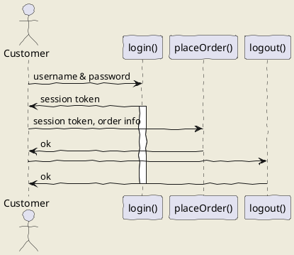
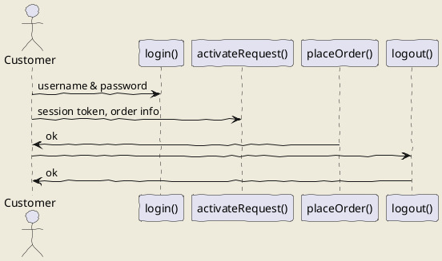

lantuml
@startuml 
actor client

database db
db -> app
app -> client

@enduml
```




#Automation
## Handle Request


##Django shell 

### creating models
python manage.py makemigrations voice_chat
python manage.py migrate voice_chat


### get data  
from django.db import models
from voice_chat.models import *
Config.objects.filter(name="poalim").values()

### create new  
# Create a new record.
>>> q = Question(question_text="What's your name?", pub_date=timezone.now())
# Save the object into the database. You have to call save() explicitly.
>>> q.save()
>>> q.id


--> User says the name of the site/service in want to use
userRequest:
    - retrieve site yaml and script
    - 
    


- On [onLoad] in home page:
    activate [listening]
    ###TODO in future search also nested words (for ex. when saying "future transactions" 
    ###  it will be searched in the big yaml and then by getting the rot will be activated from login)
- current_root = None
- path = find_path (phrase)  in yaml
- if [path][0] != current_root:
    script = Sites.objects.filter(name=path[0])
    run script["login"]
- goto home (root page)
- for node in path:    
    run node script 
       


### db script -> dictionary
from voice_chat.models import * 
 data = Sites.objects.filter(name="תנועות עתידיות").values("script") 
 jdata = dict(list(data)[0]) 
 print ( jdata)
### shell history 
import readline
l= readline.get_current_history_length()
for i in range (l+1):
   readline.get_history_item(i)
 


# user say what he wants 
# system search for the similar text in yaml
- system activates algorithm to get crawling path
- system activates crawling by path order

import json
with open ("/home/moshe/Downloads/data.json","r") as json_file:
    data = json.load(json_file)
    for command in data["tests"][0]["commands"]:
        if command["name"] not None:
            if "קוד משתמש" in command["name"]:
                print (command)

#

##Voice Chat
- [web speech documentation](https://wicg.github.io/speech-api/)
- [wrking demo](https://www.labnol.org/software/add-speech-recognition-to-website/19989/)
    - create Sites model 
        - name
        - file_name
    - when calling name
        - aproperiate file will be opened
        - using accessible name the file will traverse the 
            file till the suitable accessible name is found
            [before starting the traverse the accessible name will be searched]
            
     
###Create Django Project - actions

cd /home/moshe/workspace/projects/
django-admin startproject Automation
cd Automation/
python manage.py startapp selenium_convertor
source venv/bin/activate
python3 -m venv env
source env/bin/activate
pip3 install django
pip3 install psycopg2
python manage.py makemigrations selenium_convertor
python manage.py migrate
sudo su - postgres
psql
CREATE DATABASE automation;


## Trouble Shootings

django :
    new field : https://stackoverflow.com/questions/42613536/django-programming-error-column-does-not-exist-even-after-running-migrations