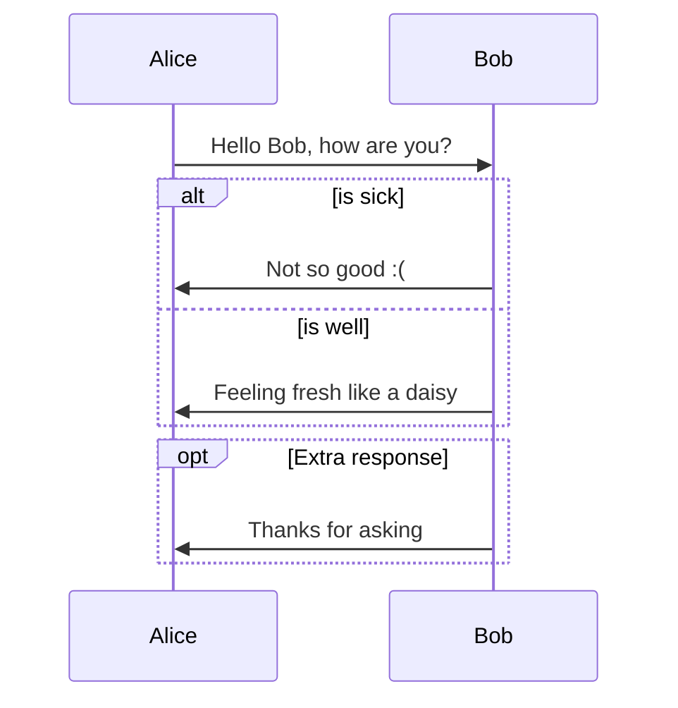
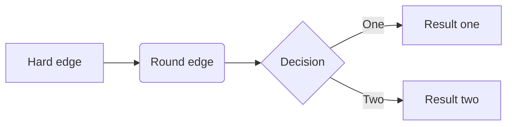
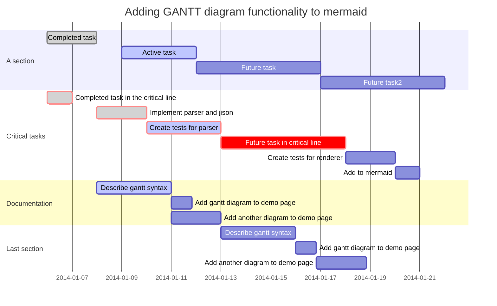

# Speak to code 
## dictionary
- command : first word in sentence  

## yaml 
All:
  command:
    open: 
      handler:browse()
      synonyms:[browse,]

    

## assumptions
- we save important info in specific yaml which holds known Sites
- for every "known site" we have yaml for every menu item  
- for every menu item we will add a list of other ways of saying  
 
## preWork
- In the start of run the program will build a list of key, value pairs that hav the "sayings"
  as the key , and the base word as the value
 - for every "first word" there would be a function associated 
## Work 
 - User enters text 
 --If *command not in all.command list
    - show *all.command dropdown
    - if other was selected 
        - add command and handler with this name 
        - TODO add description and code
    - elif entry was chosen 
        - add command as synonym to the selected entry
        

    
    

